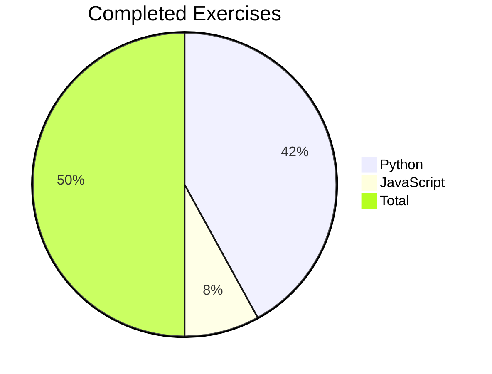

# 🚀 Exercism Learning Journey


Welcome to my Exercism learning repository! This repository showcases my progress through the [Exercism](https://exercism.org/) programming challenges in both JavaScript and Python. Here, you'll find my solutions, learnings, and growth as a developer.

## 🔍 About

[](https://exercism.org/)

[Exercism](https://exercism.org/) is an incredible platform that offers coding exercises and mentorship to help developers level up their programming skills through practice and feedback. This repository serves as a personal record of my coding journey, documenting my solutions and progress through various programming concepts and challenges.

## 📊 Progress Overview



## 🗂️ Repository Structure

```
📦 Exercism
├── 📂 javascript/          # JavaScript exercises
│   ├── 📂 exercise-1/     # Individual exercise folders
│   └── ...
└── 📂 python/             # Python exercises
    ├── 📂 exercise-1/     # Individual exercise folders
    └── ...
```

## 📈 Progress

### 🐍 Python (21/21) 🎉

| Exercise                 | Status | Difficulty |
| ------------------------ | :----: | :--------: |
| Hello World              |   ✅   |    Easy    |
| Currency Exchange        |   ✅   |    Easy    |
| Armstrong Numbers        |   ✅   |   Medium   |
| Black Jack               |   ✅   |   Medium   |
| Bob                      |   ✅   |    Easy    |
| Collatz Conjecture       |   ✅   |    Easy    |
| Darts                    |   ✅   |    Easy    |
| Ghost Gobble Arcade Game |   ✅   |   Medium   |
| Grains                   |   ✅   |    Easy    |
| ISBN Verifier            |   ✅   |   Medium   |
| Isogram                  |   ✅   |    Easy    |
| Leap                     |   ✅   |    Easy    |
| Little Sister's Vocab    |   ✅   |    Easy    |
| Meltdown Mitigation      |   ✅   |   Medium   |
| Pangram                  |   ✅   |    Easy    |
| Perfect Numbers          |   ✅   |   Medium   |
| Pig Latin                |   ✅   |   Medium   |
| Raindrops                |   ✅   |    Easy    |
| Reverse String           |   ✅   |    Easy    |
| Rotational Cipher        |   ✅   |   Medium   |
| Triangle                 |   ✅   |    Easy    |

### 🌟 JavaScript (4/6)

- [x] Hello World
- [x] Lasagna
- [x] Freelancer Rates
- [x] Annalyn's Infiltration
- [ ] Poetry Club Door Policy
- [ ] More to come...

## 🏆 Achievements

- 🏅 Completed 21 Python exercises
- 🚀 Mastered various programming concepts
- 📈 Consistently solving challenges

## 🚀 Getting Started

Ready to start your own coding journey? Here's how to get started with Exercism:

1. 🎯 Visit [exercism.org](https://exercism.org/) and create an account
2. 💻 Install the [Exercism CLI](https://exercism.org/docs/using/solving-exercises/working-locally)
3. 🏗️ Choose your favorite programming language track
4. 🧩 Start solving challenges and level up your skills!

## 📝 Notes

- Each exercise includes the problem description and my solution
- Solutions are my own work unless otherwise noted
- I welcome feedback and suggestions for improvement
- Check out my progress on [my Exercism profile](https://exercism.org/profiles/MusicalViking)

---

<div align="center">
  Made with ❤️ and Python 🐍

[](https://github.com/MusicalViking/exercism)
[](https://github.com/MusicalViking/exercism/network/members)

Happy coding! 🚀

</div>
